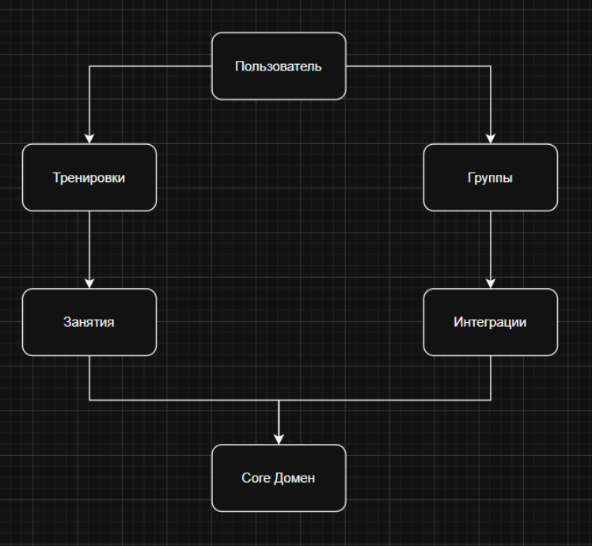

# Домены

- Пользователь 
Профиль пользователя 
Параметры активности 
Чаты с друзьями/участниками групп 
Пользовательские настройки

- Тренировка 
Тренировочные сессии (начало, выполнение, завершение) 
Параметры тренировки (дистанция, пульс, темп, нагрузки) 
История тренировок 
Классификация тренировок по типам (бег, велосипед, силовые) 

- Группа 
Тематические группы 
Роли участников 
Публикации, обсуждения 
Групповые достижения и активности 

- Занятие
Расписание занятий
Приглашение участников 
Статусы участия 
Связь с тренировками и группами 
 
- Интеграция 
Источники данных (смарт-часы, фитнес-браслет, приложения) 
Синхронизация тренировок
Синхронизация физиологических данных 
Обработка конфликтных данных (приоритет источника) 

Core Домен: отслеживание спортивных метрик взаимодействуя с пользователем  

